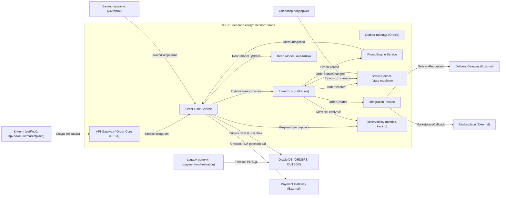

> **Назначение документа**: описать, какие участки легаси‑системы нужно изменить, почему именно они являются точками трансформации, как будет выглядеть целевая архитектура первого этапа и как проверить, что изменение действительно приблизило систему к цели.

---

## 0. Паспорт документа

| Поле | Значение |
|---|---|
| **Название проекта** | RetailCore → Order‑Core Transformation |
| **Бизнес‑сценарий** | Оформление заказа (checkout) + управление статусами + интеграция с логистикой и платёжными шлюзами |
| **Горизонт целевой архитектуры** | Первый релиз / пилот — изолировать ядро заказа, ввести событийный слой и сервис‑фасад для логистики |
| **Автор** | Архитектор решений —  Денис Тарабычин |
| **Дата** | 2026‑08‑16 |
| **Версия** | 1.0 |
| **Связанные документы** | `migration-roadmap.md`, `cutover-plan.md`, `risk‑log.md` |

---

## 1. Краткое резюме трансформации  

В рамках проекта **RetailCore → Order‑Core Transformation** система должна поддержать быстрый вывод новых коммерческих сценариев (промо‑механики, партнёрские предложения, персонализацию) и обеспечить предсказуемую устойчивость процесса оформления заказа в пиковые периоды. Текущие препятствия: монолитный оркестратор со‑склеенными бизнес‑правилами, разрозненные расчёты цены/промо, разнообразные механизмы интеграции (REST, очереди, staging‑таблицы) и отсутствие единого потока событий, из‑за чего аналитика, поддержка и новые команды работают с разными «истинными» данными.  

Для первого этапа выбраны точки трансформации:  

1. **Выделение Order‑Core Service** (минимальный публичный API, запись заказа, outbox).  
2. **Внедрение Event Bus + Transactional Outbox** (канонический поток OrderCreated, OrderStatusChanged).  
3. **Вынос расчёта скидок в PromoEngine Service** (замена PL/SQL‑fallback).  
4. **Создание Integration Facade** (унифицировать логистический обмен, убрать staging‑таблицы).  
5. **Введение Status Service (state‑machine)** (единая модель статусов, автоматические переходы).  

Целевая архитектура первого этапа не заменяет всю платформу, а изолирует критичные зависимости, вводит события, отдельные микросервисы и позволяет измерять результат метриками **time‑to‑market**, **количеством ручных вмешательств** и **p95‑latency checkout**.

---

## 2. Бизнес‑цель и критерии успеха  

| Элемент | Описание |
|---|---|
| **Бизнес‑цель** | Сократить среднее время вывода типовых коммерческих изменений (новые промо, партнёрские правила) минимум на 30 % и уменьшить количество ручных вмешательств в процесс оформления заказа минимум на 50 % в течение первых 6 мес. |
| **Пользовательская ценность** | Более быстрый отклик при оформлении (≤ 500 ms p95), более точные обещанные сроки доставки, отсутствие «неясных» статусов, которые вызывают обращения в поддержку. |
| **Операционный эффект** | Снижение нагрузки на Oracle‑БД (транзакций / сек) минимум на 40 %, сокращение времени простоя в пиковые часы, возможность масштабировать отдельные компоненты без изменения монолита. |
| **Горизонт проверки** | Через 3 мес после выпуска первой ветки (Order‑Core + Event Bus) собрать метрики и сравнить с базой; через 6 мес — добавить PromoEngine и Integration Facade, провести финальную оценку. |
| **Ограничения результата** | Не меняем процесс оплаты — payment orchestration остаётся в монолите до конца проекта; не мигрируем полностью PL/SQL‑логики, оставляем её только как fallback‑путь. |

### 2.1. Метрики успеха  

| Метрика | Базовое значение AS‑IS | Целевое значение TO‑BE | Источник данных | Частота контроля |
|---|---:|---:|---|---|
| **Время вывода коммерческого изменения** (дней от идеи до продакшна) | 30 дн. | ≤ 21 дн. | JIRA‑board, Release‑notes | Еженедельно |
| **Количество ручных вмешательств в статус‑жизненный цикл** (шт./мес.) | 850 | ≤ 425 | База `ORDER_STATUS_LOG`, запросы в support‑ticketing | Ежемесячно |
| **p95‑latency checkout** (мс) | 850 ms | ≤ 500 ms | APM‑инструменты (Prometheus + Grafana) | Ежедневно |
| **Нагрузка на Oracle (TPS транзакций)**
| 120 TPS | ≤ 70 TPS | Мониторинг DB‑CPU/IO | 1 раз в сутки |
| **Процент ошибок при оформлении** | 1.4 % | ≤ 0.5 % | Логи OrderProcessingService | Еженедельно |

---

## 3. Краткое описание AS‑IS  

| Область | Текущее состояние | Почему это важно для трансформации |
|---|---|---|
| **Бизнес‑процесс** | Оформление заказа проходит полностью через монолит *OrderProcessingService*: расчёт цены, промо, резервирование, вызовы платёжных и логистических шлюзов, запись в `ORDERS`, обновление статусов. | Основная точка отказа; любые изменения касаются почти всех команд. |
| **Компоненты** | • `Monolith Order Core (Java)`  • `Promo Service` (частичный)  • `.NET Integration Service` (staging‑tables)  • `Analytics & Reporting (Python)`  • `Oracle DB` (таблицы ORDERS, INT_ORDER_EXPORT, RETRY_DELIVERY_QUEUE, PL/SQL‑пакеты) | Сильная связность, разные технологии, отсутствие единых контрактов. |
| **Данные** | Заказ хранится в `ORDERS`; статусы – в поле `status` и отдельные таблицы‑лог; расчёт цены – в коде + PL/SQL‑fallback; правила доставки – в разных конфигурационных таблицах Oracle. | Расхождения в статусах, дублирование бизнес‑логики, невозможность построить единую аналитическую витрину. |
| **Интеграции** | • Синхронные REST‑вызовы к `paymentGateway` и `deliveryGateway`.  • Асинхронные очереди (RabbitMQ, частично Kafka‑like).  • Обмен через staging‑таблицы (`INT_ORDER_EXPORT`, `RETRY_DELIVERY_QUEUE`).  • Batch‑процедуры, nightly‑скрипты. | Смешанные протоколы усложняют оркестрацию, создают «скрытую» зависимость от Oracle, делают тестирование тяжёлым. |
| **Эксплуатация** | Логи через Log4j + ELK, метрики только JMX, частичный Prometheus. Отсутствует полная трассировка заказа, идентификаторы корреляции не везде. | Низкая наблюдаемость → долгие расследования, ручные обходы. |

---

## 4. Ограничения и допущения  

| Тип | Формулировка | Влияние на архитектуру |
|---|---|---|
| **Техническое ограничение** | Нельзя просто отключать Oracle — миграция должна идти по‑этапно, минимум 12 мес. | В первой фазе сохраняем `ORDERS` и `OUTBOX` в той же БД, новые сервисы используют её только для чтения. |
| **Организационное ограничение** | Команды используют разные стеки (Java, .NET, Python) и работают в разных репозиториях. | Пилотные сервисы создаём на Java (для совместимости), позже допускаем polyglot‑микросервисы. |
| **Инфраструктурное ограничение** | Дата‑центр on‑premise, ограниченная виртуализация, нет облачных ресурсов. | Используем существующий брокер (RabbitMQ‑like) в дата‑центре; новые сервисы разворачиваем в Docker‑контейнерах на тех же серверах. |
| **Доменное ограничение** | Некоторые правила расчёта цены зависят от региональных надбавок, которые законодательством нельзя менять без согласования. | Учитываем их в `RoutingEngine` и `PromoEngine` как конфигурацию, а не «жёсткую» бизнес‑логику. |
| **Допущение** | Метрика p95‑latency checkout измеряется корректно (от начала запроса до подтверждения). | При проверке будем использовать тот же метрик‑поток; если окажется неточным – откорректируем измерения. |

---

## 5. Препятствия первого релиза  

| Препятствие | Где проявляется | Влияние на бизнес / пользователя | Можно изменить сейчас? | Решение |
|---|---|---|---|---|
| **Отсутствие единого события оформления** | Нет Event Bus, статус‑изменения фиксируются только в таблице `ORDERS`. | Трудно построить аналитические отчёты, поддержка не видит реальный статус → задержки в обслуживании. | **Да** – добавить outbox‑таблицу и коннектор к брокеру. | **TP‑01** (Event Bus + Outbox). |
| **Расчёт скидок разбросан** (в коде, в PL/SQL, в отдельном сервисе) | `OrderProcessingService`, `legacy_promo_pkg`, `Promo Service` | Изменения промо требуют правок в нескольких местах → высокий риск. | **Да** – вынести в отдельный микросервис. | **TP‑02** (PromoEngine). |
| **Логистический фасад построен на staging‑таблицах** | `.NET Integration Service`, `INT_ORDER_EXPORT` | Дублирование данных, задержки, сложные ручные исправления. | **Да** – построить фасад с REST/Queue. | **TP‑04** (Integration Facade). |
| **Разрозненные статусы и ручные правки** | `OrderStatusService`, админ UI, batch‑процессы | Возможны конфликтные статусы → клиент видит разные данные. | **Да** – ввести единый статус‑машин. | **TP‑03** (Status Service). |
| **Сильная зависимость от синхронных платёжных вызовов** | `OrderProcessingService` → `paymentGateway` | Тайм‑ауты блокируют checkout. | **Нет** (пока оставляем как есть). | Оставляем в монолите до финального этапа. |

---

## 6. Точки трансформации  

| № | Точка трансформации | Проблема AS‑IS | Целевое изменение | Ограничения | Метрика проверки | Владелец |
|---:|---|---|---|---|---|---|
| 1 | **Order‑Core Service** (микросервис) | Монолит оркеструет всё; невозможна независимая публикация новых функций. | Публичный REST/GRPC‑endpoint, запись в `ORDERS`, генерация `OrderCreated`‑события через outbox. | Не менять схему `ORDERS`, оставить синхронный payment‑call. | p95‑latency checkout ≤ 500 ms, количество ошибок ≤ 0.5 %. | Тех‑лидер Java‑монолита (Андрей). |
| 2 | **Event Bus + Transactional Outbox** | Нет единого потока событий, статус‑изменения видны только в DB. | Kafka‑like брокер, outbox‑таблица, коннектор → `order_events`‑топик. | Доступ к брокеру только внутри дата‑центра, без облака. | Появление `OrderCreated`‑события в брокере ≥ 99 % от записей в `ORDERS`. | Архитектор интеграций (Ирина). |
| 3 | **PromoEngine Service** | Расчёт скидок разнородный (в коде, PL/SQL, отдельный сервис). | Самостоятельный сервис, вызываемый `Order‑Core` через RPC, возвращающий `discountAmount`. Фоллбек к PL/SQL только при отказе. | PL/SQL‑пакет остаётся только как fallback. | Время расчёта скидки ≤ 30 ms, процент fallback‑вызовов ≤ 5 % | Тех‑лидер Java‑монолита (Андрей). |
| 4 | **Integration Facade** | Логистика через staging‑таблицы, разные протоколы. | API‑gateway + очередь, единый контракт `DeliveryRequest/DeliveryStatus`. Убирает `INT_ORDER_EXPORT`. | Внешние партнёры должны поддерживать новый API/queue (по согласованию). | Время перехода заказа в статус *reserved* ≤ 2 с, количество дублей в доставке ≤ 1 % | Руководитель логистики (Ирина). |
| 5 | **Status Service (state‑machine)** | Статусы разбросаны по монолиту, batch‑процессам, ручным правкам. | Независимый сервис, получающий события `OrderCreated`, `PromoApplied`, `DeliveryConfirmed` и управляет переходами, публикует `OrderStatusChanged`. | Не менять логику оплаты (только статусы). | Кол-во ручных вмешательств ≤ 425 / мес, согласованность статусов ≥ 99 % (сравнение UI‑ и сервис‑данных). | Руководитель поддержки (Ольга). |

### 6.1. Паспорт точки трансформации  

#### Точка трансформации: **Order‑Core Service**

| Вопрос | Ответ |
|---|---|
| **Какой бизнес‑цели помогает?** | Сокращает время вывода новых checkout‑фич, повышает предсказуемость latency. |
| **Где находится в AS‑IS?** | Внутри `Monolith Order Core` (контейнер `OrderProcessingService`). |
| **Что именно плохо работает сейчас?** | Каждый новый сценарий меняет монолит, требует полного билд‑деплоя, высока связность с PL/SQL и другими сервисами. |
| **Что изменится в TO‑BE?** | Выделенный микросервис с чистым API, запись в `ORDERS`, публикация события в outbox, без прямого обращения к promo‑/routing‑логике. |
| **Что не меняется на этом этапе?** | Платёжный оркестратор остаётся в монолите; PL/SQL‑fallback в `LegacySqlExecutor`. |
| **Какие ограничения учитываются?** | Не допускаем изменения схемы `ORDERS`, сохраняем синхронный вызов `paymentGateway`. |
| **Как проверяем результат?** | Метрика p95‑latency checkout, процент ошибок, наличие `OrderCreated`‑сообщения в брокере. |
| **Что будет считаться неуспехом?** | > 5 % запросов падают с ошибкой 5xx, или latency > 1 s после 2‑недельного мониторинга. |

*(Для остальных точек трансформации аналогично – заполнить при необходимости.)*  

---

## 7. Матрица прослеживаемости изменений  

| Препятствие AS‑IS | Бизнес‑эффект, который нужно получить | Точка трансформации | Архитектурное решение | Метрика |
|---|---|---|---|---|
| Нет единого события оформления | Ускорить вывод новых промо‑правил | TP‑1 (Order‑Core) + TP‑2 (Event Bus) | Выделить сервис‑оркестратор, добавить outbox‑коннектор | p95‑latency checkout ≤ 500 ms |
| Дублирование расчёта скидок | Сократить ручные правки, уменьшить риск регрессий | TP‑3 (PromoEngine) | Выделить PromoEngine, использовать fallback только при отказе | % fallback‑вызовов ≤ 5 % |
| Стадные таблицы для логистики | Уменьшить время обработки доставки, убрать дублирование | TP‑4 (Integration Facade) | Унифицировать API/Queue, избавиться от staging‑таблиц | Время “reserved” ≤ 2 с |
| Неединые статусы заказа | Снизить количество обращений в поддержку | TP‑5 (Status Service) | State‑machine, публикация `OrderStatusChanged` | Ручные вмешательства ≤ 425 / мес |

---

## 8. Анализ связности  

| Вид связности | Где проявляется | Последствие | Как ослабляем в TO‑BE |
|---|---|---|---|
| **По данным** | Общие таблицы `ORDERS`, `INT_ORDER_EXPORT`, справочники в Oracle | Любое изменение в одном модуле требует миграции схемы, риск разрыва | Ввести *ownership* за данными: `Order‑Core` владеет `ORDERS`, остальные сервисы читают только через события/Read‑Model. |
| **По вызовам** | Синхронные REST‑вызовы payment‑gateway, delivery‑gateway из монолита | Тормозит checkout, повышает latency | Перевести вызовы в асинхронный «fire‑and‑forget» с компенсацией; оставляем только payment‑call синхронным. |
| **По развёртыванию** | Один общий релиз монолита → нельзя выкатывать отдельные фичи | Долгое время вывода изменений | Использовать feature‑flags и отдельные микросервисы (Order‑Core, PromoEngine, Integration Facade). |
| **По процессу** | Ручные процедуры в support‑UI, ad‑hoc SQL‑скрипты | Непредсказуемые ошибки, долгие расследования | Стандартизировать статус‑модель, добавить журнал событий, автоматизировать откаты. |

---

## 9. Транзакционные границы  

| Бизнес‑операция | AS‑IS граница | TO‑BE граница | Тип согласованности | Компенсация / обработка ошибок |
|---|---|---|---|---|
| **Создание заказа** | Одна монолитная транзакция (INSERT → promo → payment → delivery). | `Order‑Core` сохраняет запись в `ORDERS` + пишет `OrderCreated` в outbox (atomic). Затем отдельные сервисы (PromoEngine, Integration Facade, Payment) реагируют асинхронно. | **Strong** для записи заказа; **Eventual** для промо/доставки. | Если promo‑/delivery‑service не ответил – статус `PENDING`, автоматический retry через очередь. |
| **Оплата** | Синхронный call к платёжному шлюзу, блокирующий транзакцию. | Остаётся в монолите (не меняем). | **Strong** (требуется атомарность). | При ошибке – возврат к статусу `PAYMENT_FAILED`, клиент видит сообщение. |
| **Обновление статуса** | Через `OrderStatusService` + batch‑процессы, иногда ручные правки. | `Status Service` получает события, меняет статус, публикует `OrderStatusChanged`. | **Strong** внутри сервиса (single‑record update); **Eventual** для downstream‑подписчиков. | При конфликте – автоматическое откат‑повтор (idempotent обработка). |
| **Маршрутизация доставки** | Синхронный `reserveSlot` в `OrderProcessingService`. | `Integration Facade` получает `DeliveryRequested`‑событие, отправляет запрос, получает `DeliveryConfirmed`. | **Eventual** (согласование через событие). | При тайм‑ауте – статус `DELIVERY_PENDING`, повторная попытка через DLQ. |

---

## 10. Целевая архитектура первого этапа  

### 10.1. Границы TO‑BE  

**Входит в целевое состояние**  

- `Order‑Core Service` (REST/GRPC) + `outbox`‑таблица.  
- `Event Bus` (Kafka‑like) и коннектор из `outbox`.  
- `PromoEngine Service` (REST).  
- `Integration Facade` (REST + queue) – заменяет `.NET Integration Service`.  
- `Status Service` (state‑machine, публикует `OrderStatusChanged`).  
- `Read‑Model` (построенный из событий, используется аналитикой).  

**Не входит в целевое состояние**  

- Полный переход к микросервисной оплате (платёжный оркестратор остаётся в монолите).  
- Миграция всех PL/SQL‑процедур в отдельные сервисы (оставляем только fallback).  
- Полный переход аналитики на event‑stream (будет в фазе 2).  
- Полный переход в облако (остаемся on‑premise).  

### 10.2. Компоненты TO‑BE  

| Компонент | Новый / существующий | Ответственность | Основные данные | Ключевые связи |
|---|---|---|---|---|
| **Order‑Core Service** | Новый (Java) | Приём заказа, запись в `ORDERS`, запись в `OUTBOX`. | `ORDERS` (ID, клиент, товары, базовая цена, статус). | `PaymentGateway` (sync), `Event Bus` (publish). |
| **Event Bus** | Новый (Kafka‑like, on‑prem) | Транспортировать бизнес‑события (`OrderCreated`, `OrderStatusChanged`, …). | `order_events`‑топик. | `Order‑Core`, `PromoEngine`, `Integration Facade`, `Status Service`, `Analytics`. |
| **PromoEngine Service** | Новый (Java/Python) | Расчёт скидок, возвращает `discountAmount`. | Параметры заказа, промокод. | `Order‑Core` (request/response), `Event Bus` (publish `PromoApplied`). |
| **Integration Facade** | Новый (Java) | Унифицировать обмен с партнёрами доставки и маркетплейсами (REST + queue). | `DeliveryRequest`, `DeliveryStatus`. | `Order‑Core` (event → delivery), внешние API. |
| **Status Service** | Новый (Java) | Управление жизненным‑циклом статусов, автоматические переходы, журнал. | `OrderStatusLog`, `StateMachine`. | `Event Bus` (consume), `Order‑Core` (publish), UI‑поддержка. |
| **Read‑Model / Reporting DB** | Новый (PostgreSQL/ClickHouse) | Хранилище для аналитики, построено из событий. | Денормализованные витрины заказов, статусов, промо. | `Event Bus` (consumer), `Analytics Service`. |
| **Legacy Monolith (частичный)** | Сущий | Платёжный оркестратор, fallback‑логика PL/SQL. | `LegacySqlExecutor`, `paymentGateway`. | Внутренний вызов из `Order‑Core`. |
| **Oracle DB** | Сущий | Таблица `ORDERS`, `OUTBOX`, справочники. | Заказы, транзакции. | `Order‑Core` (write), `Read‑Model` (read‑only). |

### 10.3. Ключевые архитектурные решения  

| № | Решение | Почему выбрано | Какие ограничения учитывает | Какие риски создаёт |
|---:|---|---|---|---|
| 1 | **Strangler‑Fig** — поэтапный вывод микросервисов из монолита | Позволяет выпускать небольшие, проверяемые части без риска полной недоступности. | Ограничение C‑02 (Oracle остаётся), C‑03 (физический дата‑центр). | Возможные несовместимости данных между сервисами, требуются миграционные скрипты. |
| 2 | **Transactional Outbox** + **Event Bus** | Обеспечивает strong‑consistency между записью в `ORDERS` и публикацией события; упрощает ретроспективный аудит. | Требует доступ к той же БД, не может быть использовано для платёжных транзакций. | Потенциальный рост размера `OUTBOX`‑таблицы, необходимость очистки. |
| 3 | **Сервис‑фасад для логистики** (Integration Facade) | Убирает разрозненные staging‑таблицы, упрощает поддержку новых партнёров. | Требует согласования нового API с внешними партнёрами (ограничение организационное). | На этапе запуска могут возникнуть несовпадения форматов сообщения. |
| 4 | **Отдельный PromoEngine** | Централизует бизнес‑правила промо, упрощает тестирование и быстрый вывод новых акций. | Оставляем fallback‑вызов к PL/SQL (техническое ограничение). | Возможны несоответствия между legacy‑discount и новым сервисом до полной миграции. |
| 5 | **Status Service (state‑machine)** | Унифицирует статусы, создает единую точку правды, уменьшает ручные правки. | Не меняет процесс оплаты (ограничение). | Требуется согласование новых статусов со всеми командами (продажи, support, логистика). |

---

## 11. Диаграмма TO‑BE  

### 11.1. Пояснение к диаграмме  

| Элемент диаграммы | Что означает в кейсе | Почему важен для трансформации |
|---|---|---|
| **API‑Gateway / Order‑Core** | Внешняя точка входа для всех каналов (веб, мобиль, marketplace). | Позволяет перенаправить все новые запросы к микросервису, оставив только запись в `ORDERS`. |
| **Outbox таблица** | Таблица в Oracle, в которой транзакционно записываются события. | Гарантирует согласованность записи заказа и публикации события без двойных записей. |
| **Event Bus** | Асинхронный транспорт (Kafka‑like) внутри дата‑центра. | Разделяет компоненты, устраняет синхронные зависимости, даёт возможность масштабировать потребителей. |
| **PromoEngine** | Сервис расчёта скидок/акций. | Убирает дублирование расчётов в монолите и PL/SQL, ускоряет вывод промо‑изменений. |
| **Integration Facade** | Унифицированный шлюз к логистическим партнёрам и marketplace. | Заменяет старый набор staging‑таблиц и ad‑hoc интеграций, упрощает добавление новых партнёров. |
| **Status Service** | Состояние заказа как отдельный сервис‑состояние. | Делает статусы единой правдой, уменьшает ручные исправления и упрощает поддерж‑UI. |
| **Read‑Model** | Денормализованная витрина, построенная из событий. | Снимает нагрузку с Oracle для аналитики, обеспечивает согласованность данных. |
| **Observability** | Метрики, трассировки, логи всех компонентов. | Позволяет быстро находить узкие места и проверять, что изменения действительно улучшают p95‑latency. |
| **Legacy монолит (payment‑orchestration)** | Оставляем только платёжный оркестр, вызываемый из Order‑Core. | Минимальный риск, сохраняет атомарность финансовых транзакций до полного перехода. |

---

## 12. Разрывы между AS‑IS и TO‑BE  

| Область | AS‑IS | TO‑BE | Разрыв | Как закрывается в roadmap |
|---|---|---|---|---|
| **Процесс** | Один монолитный поток checkout (синхронный, heavy). | Разбитый на микросервисы + event‑bus; payment‑orchestrator остаётся sync, остальные async. | Требуется добавить outbox, изменить код OrderProcessingService. | Этап 1 — внедрить Order‑Core + Outbox. |
| **Данные** | `ORDERS` + множество справочников в одной схеме, прямой доступ из разных сервисов. | `Order‑Core` владеет `ORDERS`; остальные сервисы используют только события и Read‑Model. | Нужно реализовать отдельный Read‑Model и согласовать схемы. | Этап 2 — создать Read‑Model, мигрировать аналитические запросы. |
| **Интеграции** | Смешанные: REST, staging‑tables, batch, очередь. | Унифицированный Integration Facade + Event Bus, удалены staging‑таблицы. | Требуется согласовать новые API с партнёрами. | Этап 3 — пилотная интеграция с одним партнёром, потом масштаб. |
| **Наблюдаемость** | Логи в ELK, метрики в JMX, отсутствие трассировки. | Централизованная Observability (metrics, tracing, correlation‑ids) во всех сервисах. | Нужно добавить correlation‑ids и экспортировать их в систему мониторинга. | Этап 1‑2 — внедрить middleware‑логгер, добавить OpenTelemetry. |
| **Эксплуатация** | Ручные обходы, отсутствие автоматических rollback‑планов. | Автоматические ретраи через DLQ, idempotent‑обработчики, fallback‑логика. | Нужно реализовать DLQ и idempotent‑логики в новых сервисах. | Этап 4 — добавить DLQ и тестировать сценарии отказов. |

---

## 13. Риски и открытые вопросы  

| Риск / вопрос | Тип | Влияние | Как проверяем / контролируем | Владелец | Срок уточнения |
|---|---|---|---|---|---|
| **Сбои в outbox‑коннекторе** | Технический | Потеря событий → расхождения статусов. | Мониторинг `outbox`‑lag, алерт при задержке > 30 сек. | Архитектор интеграций (Ирина) | 2026‑09‑30 |
| **Неоднородность результатов промо‑расчётов** (fallback vs новый сервис) | Технический | Несогласованные цены → клиентские жалобы. | Сравнительная проверка `discountAmount` в тест‑окружении, % fallback‑вызовов < 5 %. | Тех‑лидер (Андрей) | 2026‑10‑15 |
| **Отказ внешних партнёров при переходе к фасаду** | Операционный | Потеря доставки, возврат заказов. | Пилотный запуск с одним партнёром, SLA‑договорённость, fallback‑логика. | Руководитель логистики (Ирина) | 2026‑11‑01 |
| **Сопротивление команд к миграции** | Организационный | Замедление rollout, блокировки. | Регулярные демо, согласование roadmap, обучение. | Руководитель проекта (Дмитрий) | 2026‑09‑01 |
| **Ограничения ресурса в дата‑центре** (CPU, RAM) | Инфраструктурный | Невозможность масштабировать новые сервисы. | План capacity‑planning, пилотные контейнеры на текущих серверах. | Инфраструктурная команда | 2026‑10‑01 |
| **Неполные SLA‑метрики от внешних шлюзов** | Бизнес | Невозможность оценить реальное время отклика. | Договориться о предоставлении метрик, использовать клиент‑тайм‑ауты. | Бизнес‑заказчик (Дмитрий) | 2026‑09‑15 |

